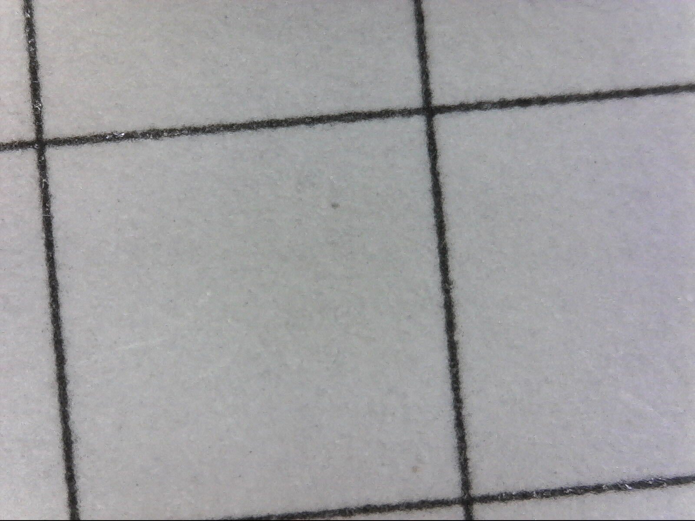

# Calibrating the printer
...by which I really just mean, getting the right toner density and figuring out
how close to the paper edges we can get. Here's my test page source:

```ps
/inch       {72 mul} def
/cell {inch 0.2 mul} def

/hcells {8.5 5 mul} def
/vcells {11  5 mul} def

/vline { newpath dup 0      moveto 11 inch       lineto stroke } def
/hline { newpath dup 0 exch moveto 8.5 inch exch lineto stroke } def

0.1 setlinewidth
0.5 setgray

0 1 hcells {cell vline} for
0 1 vcells {cell hline} for

showpage
```

...and here's the resulting toner deposition:



This is way too heavy; let's try some more configurations, both with thinner
lines and lighter grayscale.


## 0.01pt line width, 10% gray
```ps
/inch       {72 mul} def
/cell {inch 0.2 mul} def

/hcells {8.5 5 mul} def
/vcells {11  5 mul} def

/vline { newpath dup 0      moveto 11 inch       lineto stroke } def
/hline { newpath dup 0 exch moveto 8.5 inch exch lineto stroke } def

0.01 setlinewidth
0.9  setgray

0 1 hcells {cell vline} for
0 1 vcells {cell hline} for

showpage
```

