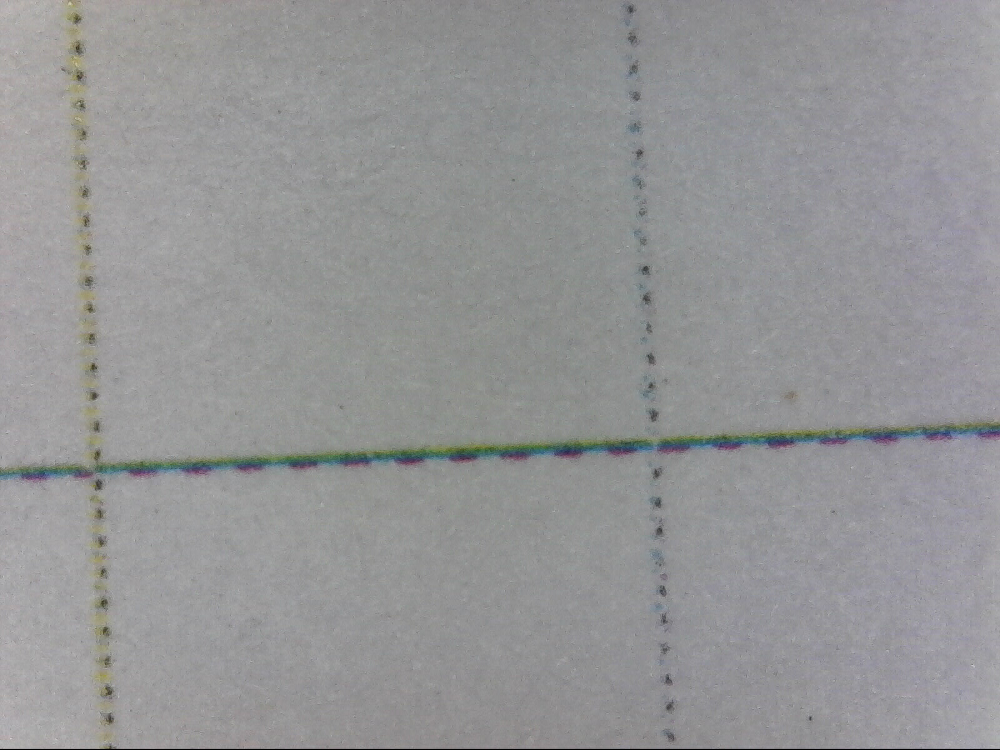
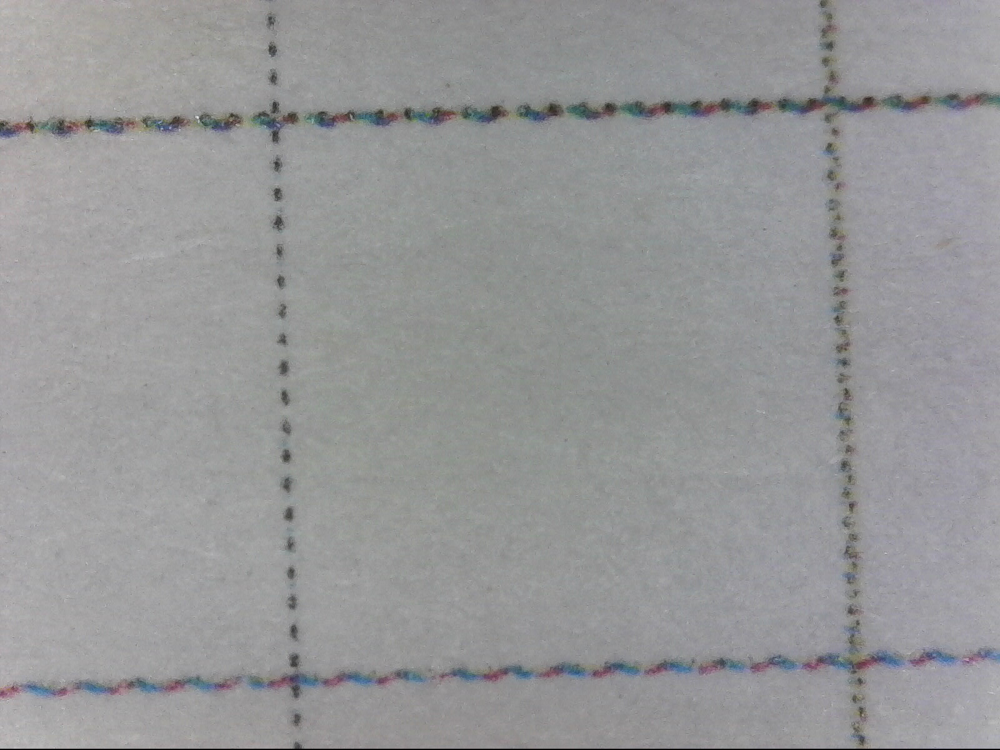
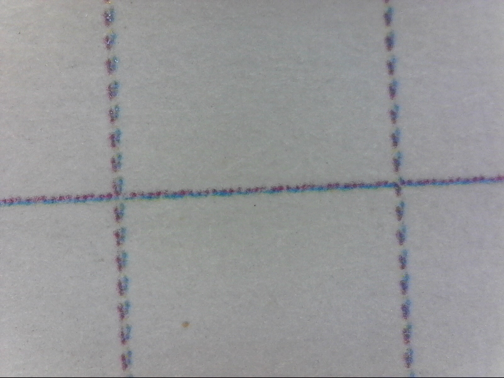
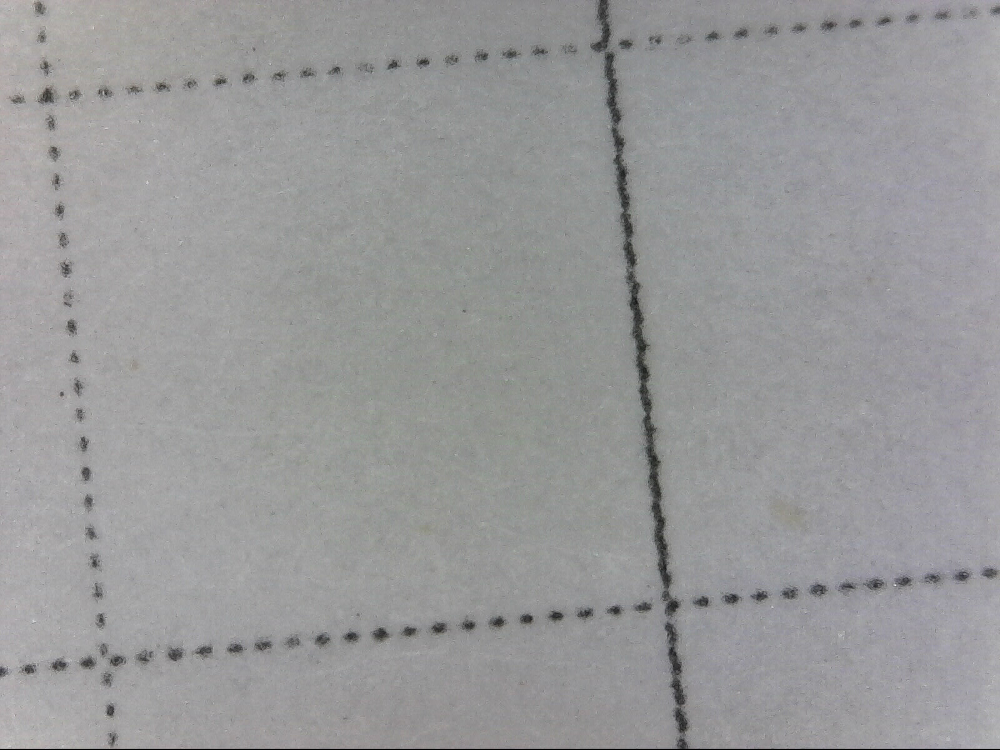
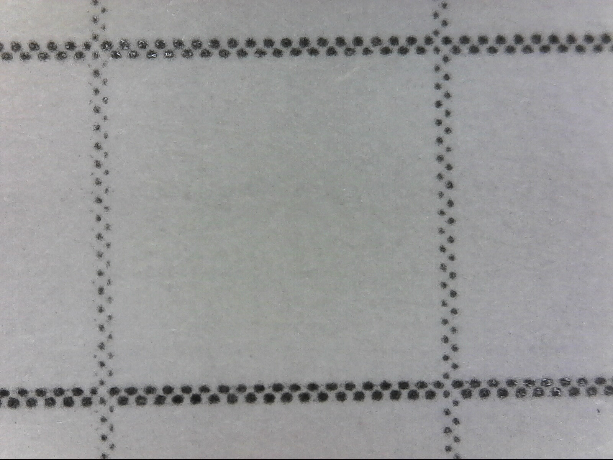
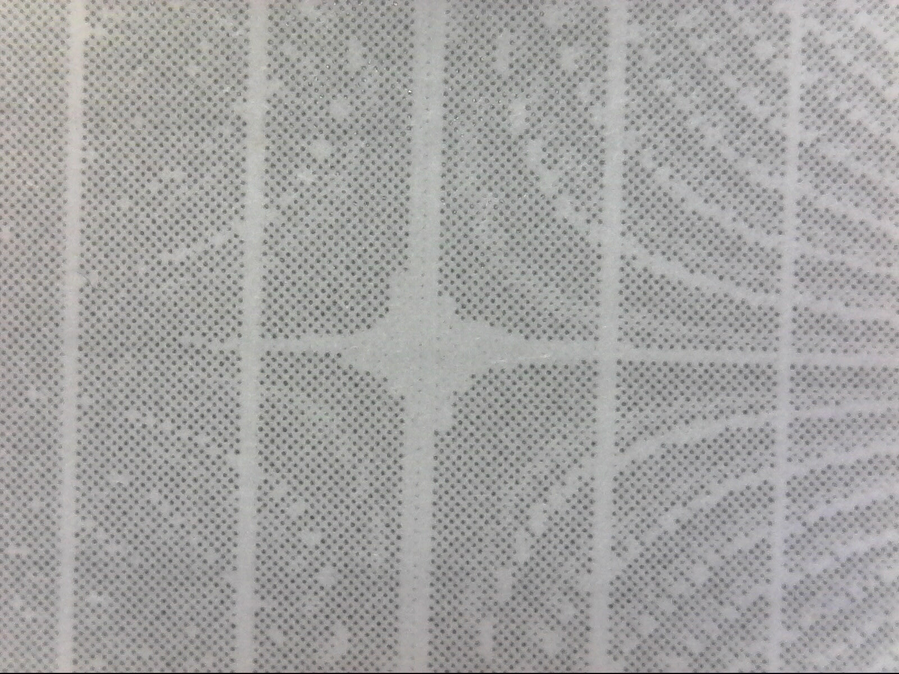

# Calibrating the printer
...by which I really just mean, getting the right toner density and figuring out
how close to the paper edges we can get. Here's my test page source:

```ps
/inch       {72 mul} def
/cell {inch 0.2 mul} def

/hcells {8.5 5 mul} def
/vcells {11  5 mul} def

/vline { newpath dup 0      moveto 11 inch       lineto stroke } def
/hline { newpath dup 0 exch moveto 8.5 inch exch lineto stroke } def

0.1 setlinewidth
0.5 setgray

0 1 hcells {cell vline} for
0 1 vcells {cell hline} for

showpage
```

...and here's the resulting toner deposition:


This is way too heavy; let's try some more configurations, both with thinner
lines and lighter grayscale.


## 0.01pt line width, 10% gray
```ps
0.01 setlinewidth
0.9  setgray
```

Aaaaand no marks at all. Let's go back to 0.1 on the line width, but keep the
light shading.


## 0.1pt line width, 10% gray
```ps
0.1 setlinewidth
0.9 setgray
```

Nothing here either. That means the printer driver is probably quantizing the
color and printing in monochrome. OK, let's skip the gray and just set the line
width.


## 0.01pt line width, 100% black
```ps
0.01 setlinewidth
0    setgray
```

This looks identical to the 0.1pt lines, which means we're hitting a minimum
line width -- probably in the PostScript layer. What happens if we print as PNG?


## 0.01pt line width, 10% gray, as PNG
I had to first edit `/etc/ImageMagick-6/policy.xml` to allow PostScript
conversion. After that:

```ps
0.01 setlinewidth
0.9  setgray
```

```sh
$ convert -density 1200 -flatten -trim graphbase.ps \
          -alpha off -antialias graphbase.png
$ lpr graphbase.png
```

Hmm, still no marks on the paper. That's a bit surprising given that we should
be printing in raster mode. How about JPG?

```sh
$ convert -density 1200 -flatten -trim graphbase.ps \
          -alpha off -antialias -quality 100 graphbase.jpg
$ lpr graphbase.jpg
```

Still completely blank. I suspect the printer isn't being set to color mode,
although I'm not entirely sure why.


## Let's solve the color problem: test page
In particular, let's find out where we lose output by changing the line shade by
position. I'll do both horizontal and vertical in case there's a difference.

```ps
0 1 hcells {dup hcells div setgray cell vline} for
0 1 vcells {dup vcells div setgray cell hline} for
```

```sh
$ convert -density 1200 -flatten -trim graphbase.ps \
          -alpha off -antialias -quality 100 graphbase.jpg
$ lpr graphbase.jpg
```



Huh! At least we're getting the printer to render more detail -- although I have
a couple of complaints. First, the quality is egregious; it's easy to see at a
glance that there are individual dots on the page. Second, the color balance is
also way off. What happens with PNG?

(Also, the printer's resolution is 9600x600dpi, so let's rasterize at 600
instead of 1200.)

```sh
$ convert -density 600 -flatten -trim graphbase.ps \
          -alpha off -antialias graphbase.png
$ lpr graphbase.png
```



Better, but still a bit wonky. There's visible color bias between lines. I'm
going to set the document type to "standard" and screen to "detailed" in the
print settings and try the same image again:

```sh
$ lpr graphbase.png
```



Awesome, things are improving: the lines subjectively look closer to gray, not
random colors. Still some visible dots but we're on the right track. Let's
change a few more settings:

- Color mode: off
- Samsung color management: corporate imaging
- Clear text: off
- Edge enhancement: off
- Trapping: off
- Document type: business graphic

My hunch is that using business/corporate settings will make the printer conform
more directly to the input, but I'm not sure.

```sh
$ lpr graphbase.png
```



This is pretty good. There's still some aliasing going on, which I bet is due to
the fact that we're rasterizing at exactly the print resolution. Next step:
rasterize at 720DPI and deactivate antialiasing.

```sh
$ convert -density 720 -flatten -trim graphbase.ps \
          -alpha off graphbase.png
$ lpr graphbase.png
```

Hmm, no good; I'm still getting high-level interference patterns. Let's change
the strategy a little by widening the lines to 0.2pt and re-exporting at 600DPI.
I'm going to keep antialiasing off for now.

```ps
0.2 setlinewidth
```

```sh
$ convert -density 600 -flatten -trim graphbase.ps \
          -alpha off graphbase.png
$ lpr graphbase.png
```

Still getting aliasing. OK, how about 0.5pt?

```ps
0.5 setlinewidth
```

```sh
$ convert -density 600 -flatten -trim graphbase.ps \
          -alpha off graphbase.png
$ lpr graphbase.png
```



**Aha:** that did it. Now we're getting reliably shaded lines with only minimal
artifacts (some appear slightly wider than others).


## Shading directly to the printer raster
The dots in the image above follow a clear pattern; they're exactly
grid-aligned, and we should be able to emit points along that grid rather than
relying on the printer to map into it. The first thing to do is [figure out what
the printer's native resolution actually is](native-resolution.ps).



I believe that's a 180DPI aliasing resolution.

I'm going to change the settings again:

- Document type: CAD
- Screen: normal
- Samsung color management: standard
- Trapping: normal (shouldn't matter since it's monochrome)

Now I'm seeing 90, 140, and 190 as interference patterns. There appears to be a
perfect intersection at 140.

**Update:** OK, I've figured this out. Anytime you render lines that aren't
completely white or black, it dithers at its internal resolution, which is close
to 200DPI. 600DPI is still the native resolution, and anything we draw from
PostScript is dithered correctly if we set the line width to one native pixel.
